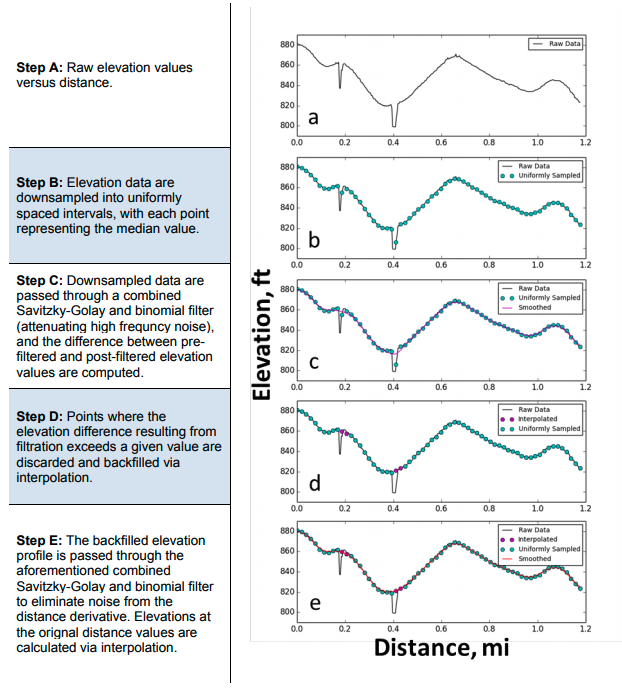

# GradeIT
Road Grade Inference Tool (GradeIT) - a python package, developed by the National Renewable Energy Laboratory, 
to append elevation and road grade to a sequence of GPS points.

## Overview
GradeIT looks up and filters elevation and derives road grade from the 
[USGS Digital Elevation Model](https://www.usgs.gov/core-science-systems/ngp/3dep) to append to GPS points, typically 
for vehicles traveling on paved roads. The python package offers options to use either the the freely accessible USGS
[Elevation Point Query Service](https://nationalmap.gov/epqs/) or a locally available raster database of the elevation 
model, which provides much faster results.

## Setup
Clone or download the git repository.

```git clone https://github.com/NREL/gradeit.git```

gradeit depends on gdal. One way to satisfy this is to use conda:

```
conda create -n gradeit python=3.8 gdal
conda activate gradeit
```

This will create a new conda environment that uses python 3.8.

Then, you can install the gradeit library

```pip install gradeit```

or if you're already in the gradeit root directory then:

```pip install .```

## Getting Started
In this repository, `docs/demo.ipynb` will demonstrate the most basic application of the gradeit package. Additionally, the [gradeit-notebooks](https://github.com/NREL/gradeit-notebooks) repo contains various Jupyter notebooks that demonstrate gradeit applications and explore potential improvements.

## USGS Elevation Data
The United States Geological Survey offers a variety of products as a part of the [National Map](https://www.usgs.gov/core-science-systems/national-geospatial-program/national-map) project, including bare-earth elevation datasets. The 1/3 arc-second elevation dataset is continuous for the coterminous United States and is therefore used in GradeIT. As shown in ```docs/demo.ipynb``` appending elevation and grade to 1000+ points benefits significantly from having a local or network copy of the required USGS elevation data.

NREL has the 1/3 arc-second raster data downloaded to on-site compute resources for large scale needs. Individual users can access the same raster data [here](https://prd-tnm.s3.amazonaws.com/index.html?prefix=StagedProducts/Elevation/13/ArcGrid/). In the future, we hope to add a utility to download and extract the necessary data for a user specified region, however, that feature is not available at this time - __contributions are encouraged!__

## Filters
Given the spatial noise that can be present in GPS data and the 1/3 arc-second resolution of the digital elevation
model being employed, outliers and unrealistic topographical features can be present in the raw elevation profiles. 
Therefore, a series of filtering procedures can be applied to the elevation data, if desired by the user. The primary
filter procedure is summarized in the figure below from Wood et al in 2014.



<sub>Wood, Eric, E. Burton, A. Duran, and J. Gonder. Appending High-Resolution Elevation Data to GPS Speed Traces for 
Vehicle Energy Modeling and Simulation. No. NREL/TP-5400-61109. National Renewable Energy Lab.(NREL), Golden, CO 
(United States), 2014.<sub>

Additionally, since the USGS Digital Elevation Model is a "bare earth" model, road infrastructure features (i.e. 
bridges and overpasses) are often not represented in the data. Rather, the "bare earth" model represents the valley or
body of water that is being spanned. GradeIT has optional filtering routines to explicitly handle this by
"building" a bridge to span the river, valley, etc where necessary.
